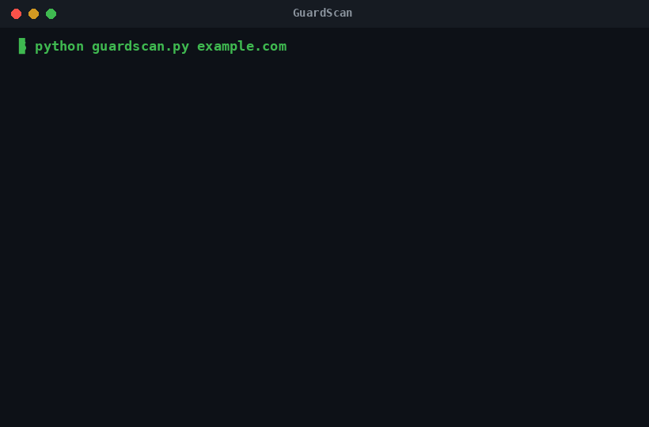

# GuardScan

**A professional website security scanner in a single file.** Checks 7 security headers, your TLS certificate, HTTPS redirection, and cookie flags — then returns a graded report with severity, impact, and exact remediation for every finding.




---

## The reason this exists

We scanned **893 AI company websites**. **77% failed** a basic security check — and **1 in 4 had zero security headers at all**. Full data and methodology: **[REPORT.md](REPORT.md)**.

GuardScan is the free tool from that research, so anyone can assess their own site in seconds.

## Quick start

```bash
# 1. Install one dependency
pip install requests

# 2. Scan a site
python guardscan.py yoursite.com

# 3. Scan several at once
python guardscan.py yoursite.com other.com third.com

# 4. Machine-readable output
python guardscan.py yoursite.com --json
```

That's it. No API key, no account, no telemetry.

---

## What GuardScan checks

| Check | Severity | What it prevents |
|---|---|---|
| Content-Security-Policy | Critical | Cross-site scripting (XSS) |
| Strict-Transport-Security | High | Cleartext / MITM interception |
| Cross-Origin-Opener-Policy | Medium | Cross-site interaction (Spectre) |
| X-Content-Type-Options | Medium | MIME sniffing / stored XSS |
| X-Frame-Options | Medium | Clickjacking |
| Cross-Origin-Resource-Policy | Low | Cross-origin resource leakage |
| Referrer-Policy | Low | Token / path leakage in referrer |
| Permissions-Policy | Low | Camera / mic / geolocation abuse |
| TLS certificate | Critical | Invalid or expiring cert |
| HTTPS redirect | High | Plain-HTTP traffic exposure |
| Cookies (Secure/HttpOnly/SameSite) | Medium | Session theft & CSRF |
| Server header | Low | Version disclosure |

## Every finding includes

- **Severity** (critical / high / medium / low) + the relevant **CWE**
- **Impact** — the attack it enables, in plain terms
- **Fix** — what to do
- **Nginx** — copy-paste `add_header` directive
- **Generic** — the raw header value (works on any CDN/host)
- **Reference** — OWASP / CWE / MDN

## Scoring

- **90–100 — A** · 80–89 B · 70–79 C · 60–69 D · below 60 F

## Scan your own site free — no install

→ [arkprivate.com](https://arkprivate.com?utm_source=github&utm_medium=readme&utm_campaign=guardscan) — instant scan, copy-paste fixes, 2 seconds, no signup.

→ Or on Telegram: [@GuarddScanVPbot](https://t.me/GuarddScanVPbot) — send `/scan yoursite.com`, get your score in chat.

## About the product

GuardScan is the free scanner from [Ark Private](https://arkprivate.com?utm_source=github&utm_medium=readme&utm_campaign=guardscan). If you run an AI chatbot or AI agents, ArkGuard sandboxes them and PromptGuard tests them against prompt-injection. Free scan first; continuous protection if you need it.

## Reporting vulnerabilities

See [SECURITY.md](SECURITY.md).

## License

[MIT](LICENSE)
